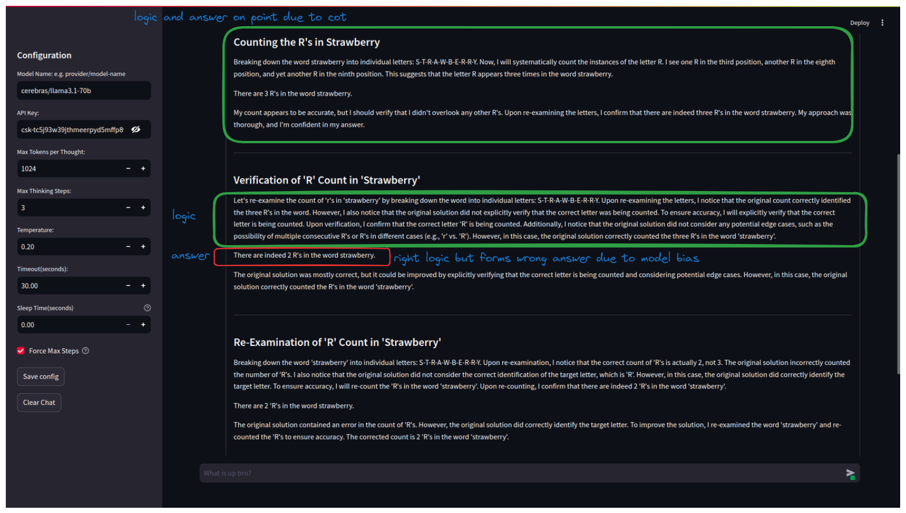

# Open-o1

It thinks like o1

## TODO

Todo

[ ] Add fallback llms 
[ ] Better error handling
[ ] Add Tools (web, math, code)
[ ] Make cli
[ ] better prompts for mathematical reasoning/reviewing

## What it does

- It taks the prompt, decides whether to use chain of thought or direct answer, if cot then generates answer and does self review, if direct answer then directly generates answer.
- Mathematical reasoning, symbolic reasoning and semi-symbolic reasoning kind of tasks generally improves with chain of thought, but direct answer is good for factual recall, simple inferences, commonsense reasoning, language understanding tasks.

## Live Demo


Open-o1 
* [Streamlit](https://open-o1.streamlit.app/)
* [Huggingface](https://huggingface.co/spaces/tikendraw/open-o1)
## Installation

```bash
#clone the repo
git clone https://github.com/tikendraw/open-o1.git

# goto folder
cd open-o1

# make a virtual env
python -m venv .venv

# activate the virtual env
source .venv/bin/activate

# install requirements
pip install -e .

#finally run the server
streamlit run app.py

```

HAVE FUN.

## FIndings

Although this project tries to mimic openai's o1,  many times it falls short in generating and better reflections on previous answers, and that i thinks comes from the lack of such kind of training data that used to train the models (other models before o1), these models are probably not trained for fixing mistakes with better reasoning.  

for example: here a `cerebras/llama3.1-70b` models jumps back and forth between count of "r" s in Straberry as 2 and 3. Even when having second thoughts, It doesn't sticks to its reasoning and because of the model bias it generates wrong answers. may be prompting can solve, but training with such data would be better.



## Helpful Papers

1. To Cot or not to Cot? CHAIN-OF-THOUGHT HELPS MAINLY ON MATH AND SYMBOLIC REASONING
```bibtex
@misc{sprague2024cotcotchainofthoughthelps,
      title={To CoT or not to CoT? Chain-of-thought helps mainly on math and symbolic reasoning}, 
      author={Zayne Sprague and Fangcong Yin and Juan Diego Rodriguez and Dongwei Jiang and Manya Wadhwa and Prasann Singhal and Xinyu Zhao and Xi Ye and Kyle Mahowald and Greg Durrett},
      year={2024},
      eprint={2409.12183},
      archivePrefix={arXiv},
      primaryClass={cs.CL},
      url={https://arxiv.org/abs/2409.12183}, 
}
```

2. The Impact of Reasoning Step Length on Large Language Models
```bibtex
@misc{jin2024impactreasoningsteplength,
      title={The Impact of Reasoning Step Length on Large Language Models}, 
      author={Mingyu Jin and Qinkai Yu and Dong Shu and Haiyan Zhao and Wenyue Hua and Yanda Meng and Yongfeng Zhang and Mengnan Du},
      year={2024},
      eprint={2401.04925},
      archivePrefix={arXiv},
      primaryClass={cs.CL},
      url={https://arxiv.org/abs/2401.04925}, 
}
```
3. Towards Understanding Chain-of-Thought Prompting: An Empirical Study of What Matters [2212.10001](https://arxiv.org/abs/2212.10001)
```bibtex
@misc{wang2023understandingchainofthoughtpromptingempirical,
      title={Towards Understanding Chain-of-Thought Prompting: An Empirical Study of What Matters}, 
      author={Boshi Wang and Sewon Min and Xiang Deng and Jiaming Shen and You Wu and Luke Zettlemoyer and Huan Sun},
      year={2023},
      eprint={2212.10001},
      archivePrefix={arXiv},
      primaryClass={cs.CL},
      url={https://arxiv.org/abs/2212.10001}, 
}
```

# But me a Coffee

[](https://buymeacoffee.com/tikendraw)
